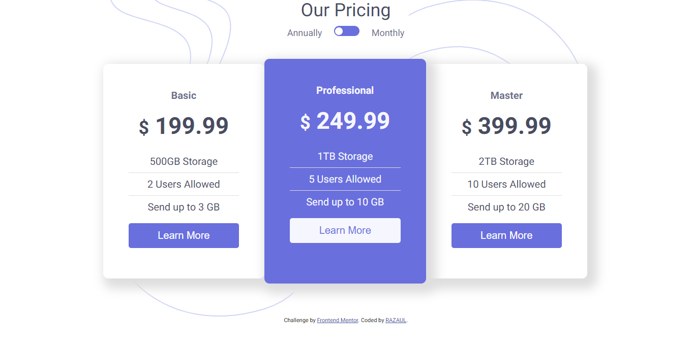

# Frontend Mentor - Pricing component with toggle solution

This is a solution to the [Pricing component with toggle challenge on Frontend Mentor](https://www.frontendmentor.io/challenges/pricing-component-with-toggle-8vPwRMIC). Frontend Mentor challenges help you improve your coding skills by building realistic projects.

## Table of contents

- [Overview](#overview)
  - [The challenge](#the-challenge)
  - [Screenshot](#screenshot)
  - [Links](#links)
- [My process](#my-process)
  - [Built with](#built-with)
  - [What I learned](#what-i-learned)
  - [Continued development](#continued-development)
  - [Useful resources](#useful-resources)
- [Author](#author)
- [Acknowledgments](#acknowledgments)

## Overview

### The challenge

- View the optimal layout for the component depending on their device's screen size
- Control the toggle with both their mouse/trackpad and their keyboard
- **Bonus**: Complete the challenge with just HTML and CSS

### Screenshot

### Links

- Solution URL: [solution URL here](https://github.com/Razaul00003/pricing-with-toggle)
- Live Site URL: [Interactive pricing with toogle ](https://pricing-toggle-razaul.netlify.app/)

## My process

### Built with

- Semantic HTML5 markup
- CSS custom properties
- Flexbox
- Desktop-first workflow
- jquery

### What I learned

// how to use multiple image in css
// css combinator selectors

### Useful resources

- [css combinators selectors](https://www.w3schools.com/css/css_combinators.asp)
- [Multiple background image property](https://www.w3schools.com/css/css3_backgrounds.asp)

## Author

- Website - [Github](https://github.com/Razaul00003)
- Frontend Mentor - [@Razaul00003](https://www.frontendmentor.io/profile/Razaul00003)

## Acknowledgments

This is amazing frontend challenge by frontend mentor. Thank you for this aweseome challenge.
